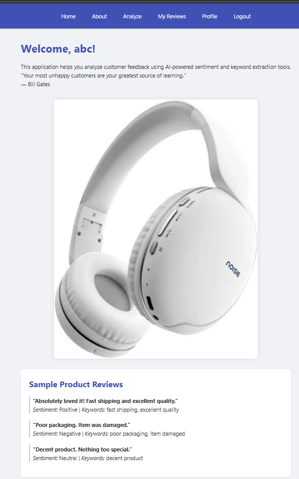
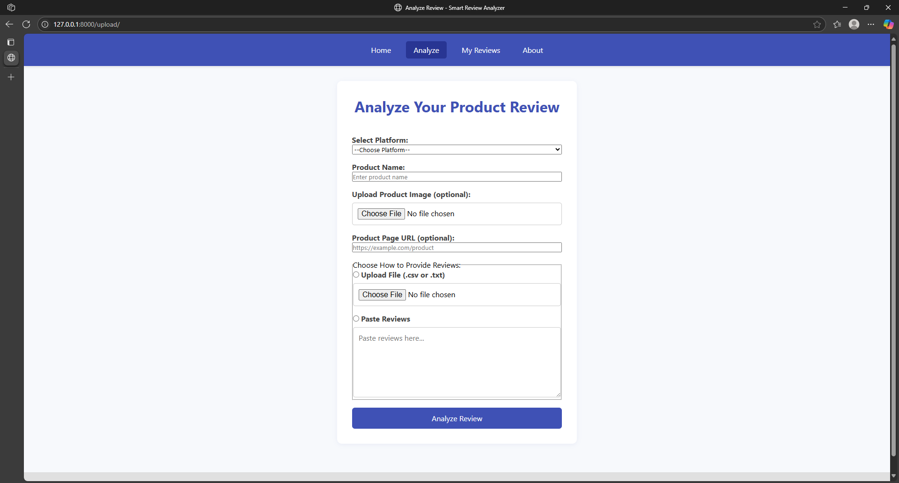
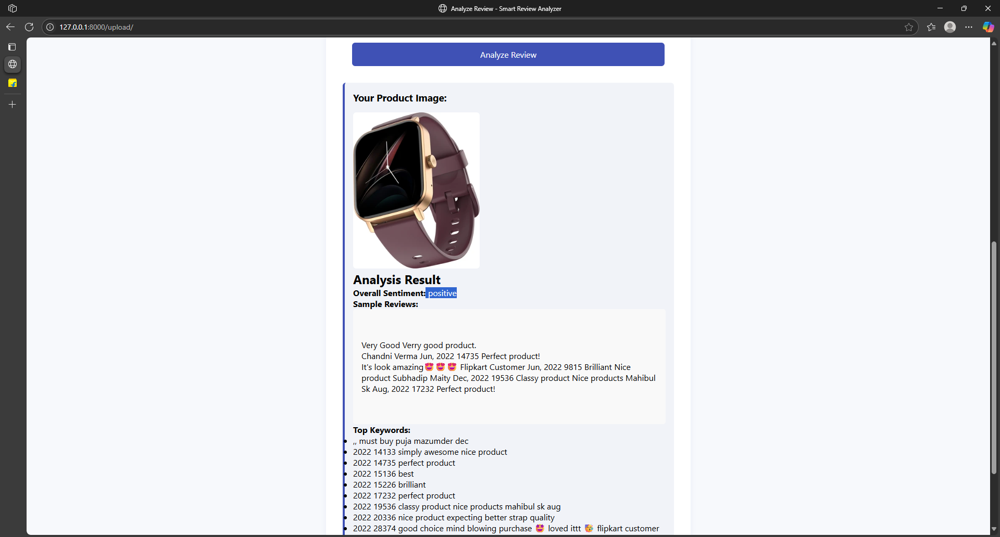
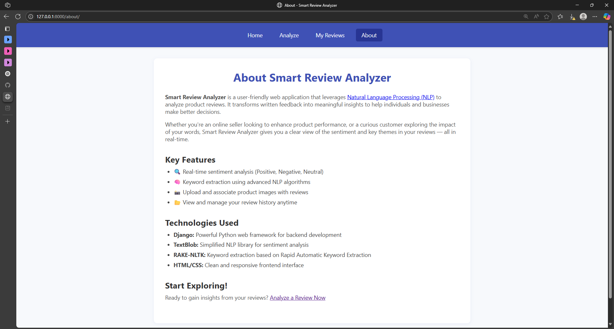

# Smart Review Analyzer

Smart Review Analyzer is a web application that uses Natural Language Processing (NLP) techniques to analyze and extract insights from product reviews.

## Features

- Sentiment analysis using TextBlob
- Keyword extraction using RAKE-NLTK
- Upload and store product images with reviews
- User review history with timestamps
- Built with Django and Flask for flexible deployment

## Technologies Used

- **Flask** – Lightweight WSGI web framework
- **Django** – High-level Python web framework
- **TextBlob** – NLP library for sentiment analysis
- **RAKE-NLTK** – Keyword extraction
- **pandas** – Data handling and manipulation
- **requests** – HTTP requests for web interactions

## Installation

1. Clone the repository:
   ```bash
   git clone https://github.com/your-username/smart-review-analyzer.git
   cd smart-review-analyzer
   ```

2. Create a virtual environment and activate it:
   ```bash
   python -m venv venv
   source venv/bin/activate  # On Windows: venv\Scripts\activate
   ```

3. Install dependencies:
   ```bash
   pip install -r requirements.txt
   ```

4. Run the application:
   - For Django:
     ```bash
     python manage.py runserver
     ```

## License

This project is licensed under the MIT License.

## Screeenshots

### Home Page


### Upload Section


### Confirmation Page


### View_Review Page


### About page

